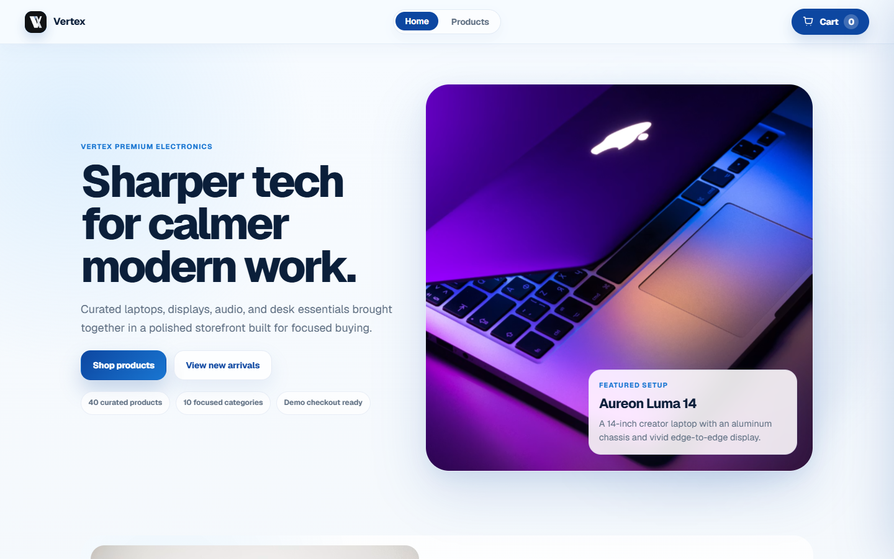
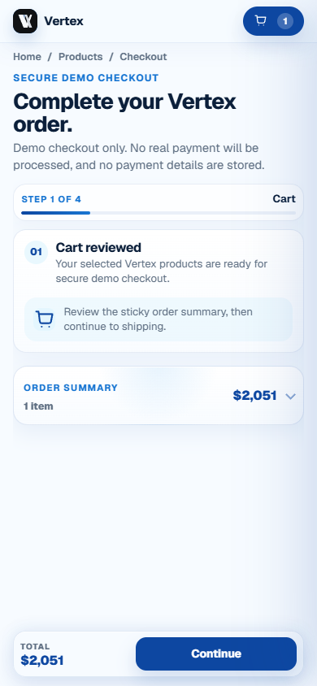

# Vertex Storefront

[](https://github.com/AlexHorodnic/vertex-storefront/actions/workflows/ci.yml)

A production-inspired Angular commerce experience connecting product discovery, variant selection, persistent cart state, and a responsive four-step checkout.

[Live app](https://vertex-storefront.alexhorodnic.com/) |
[Portfolio case study](https://alexhorodnic.com/projects/vertex-storefront)



## Product Overview

Vertex models a complete frontend buying journey across 40 typed demo products in 10 categories. Product discovery, variants, stock state, cart calculations, checkout validation, and order confirmation behave as one connected system.

The checkout is a demo. It does not process payments, and card fields are deliberately excluded from browser persistence.

## Key Capabilities

- Search, category, collection, price, and sorting controls
- Responsive desktop filters and a mobile filter sheet
- Product variants, stock states, image galleries, and related products
- Persistent cart quantities with stock-safe updates
- Promo codes, shipping methods, tax, discounts, and order totals
- Validated cart, shipping, payment, review, and confirmation steps
- Mobile checkout progress and a reachable sticky action bar
- Loading, empty, invalid, disabled, low-stock, and out-of-stock states

## Engineering Decisions

### Feature-first architecture

Home, catalog, product detail, cart, and checkout routes own page behavior. Core services and shared standalone components preserve reusable commerce state and UI, while route features remain lazy-loaded.

### Derived commerce state

Angular signals and computed values keep cart count, subtotal, discounts, delivery cost, tax, and final totals synchronized without duplicating derived values.

### Guarded browser persistence

Runtime type guards validate cart items, catalog filters, variant selections, and checkout shipping data before stored JSON re-enters application state. Invalid or stale data falls back safely.

### Checkout continuity with privacy boundaries

Shipping details are saved through a debounced snapshot so useful progress survives a refresh. Payment fields are never persisted, and later checkout steps remain unavailable until their required controls are valid.

## Responsive & Accessible UX

- Keyboard-operable dual-handle price filtering
- Desktop pointer and mobile sheet catalog controls
- Product lightbox with keyboard navigation, touch swiping, and scroll locking
- Mobile-specific checkout progress and reachable primary actions
- Labelled controls, visible focus states, semantic landmarks, and touch-friendly targets

## Tech Stack

- Angular 21
- TypeScript
- Angular Signals
- RxJS
- Reactive Forms
- SCSS
- Vitest

## Screenshots

### Desktop storefront


### Mobile checkout



## Local Development

Requirements:

- Node.js 24
- npm 11.6.2

```bash
npm ci
npm start
```

Open `http://localhost:4200`.

## Verification

```bash
npm run typecheck
npm run test:ci
npm run build
npm audit --omit=dev
```

The test suite covers cart totals and stock limits, browser persistence, product filtering and sorting, runtime guards, checkout shipping state, totals and discounts, step-access rules, and lazy route boundaries.

GitHub Actions installs dependencies, type-checks the application, runs the complete test suite, and creates a production build on pushes to `main` and on pull requests.

## Project Boundaries

Vertex is a frontend portfolio project. Products are typed mock data, imagery is sourced from Unsplash, and checkout simulates order creation.

A production storefront would require inventory and pricing APIs, authentication, server-owned carts, payment-provider tokenization, analytics, observability, and server-side validation.

## Security & Privacy

Vertex never requests or stores real payment credentials. Card fields are deliberately excluded from persistence, stored commerce state is validated before use, and the demo does not transmit checkout details to a payment processor or application backend.
